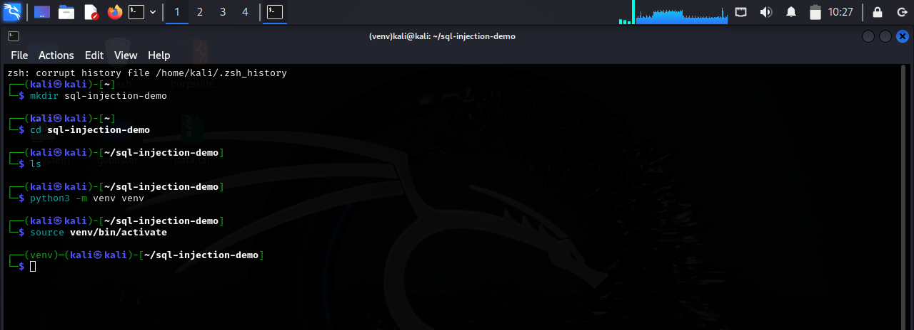
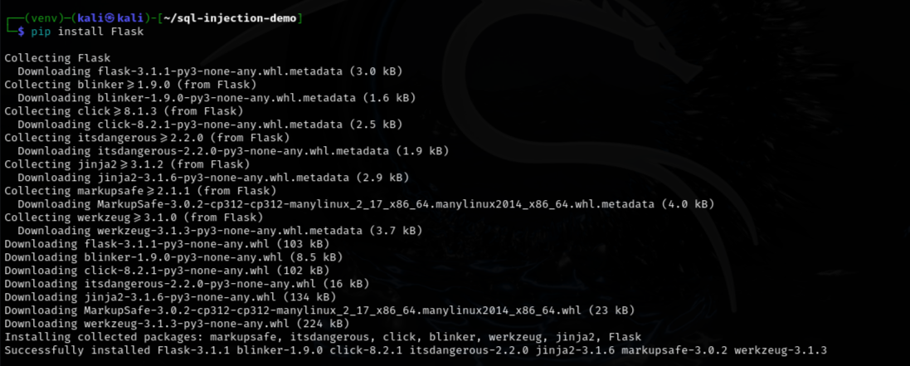
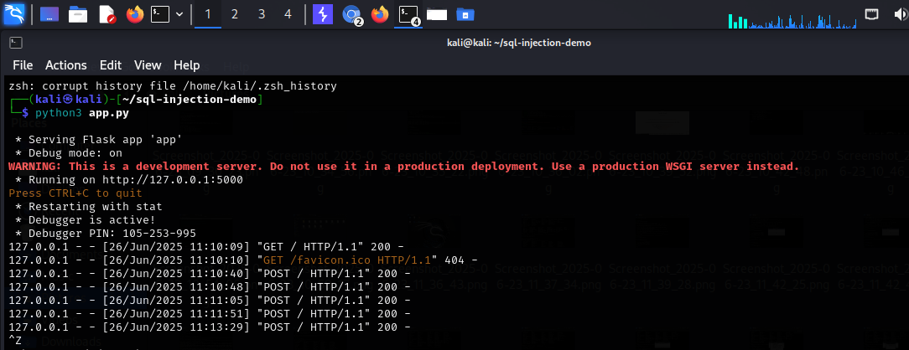
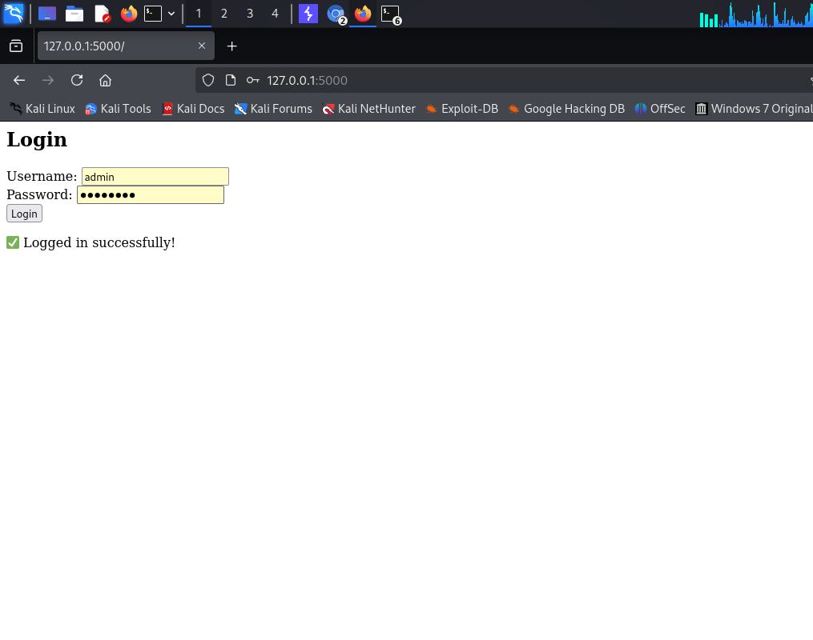
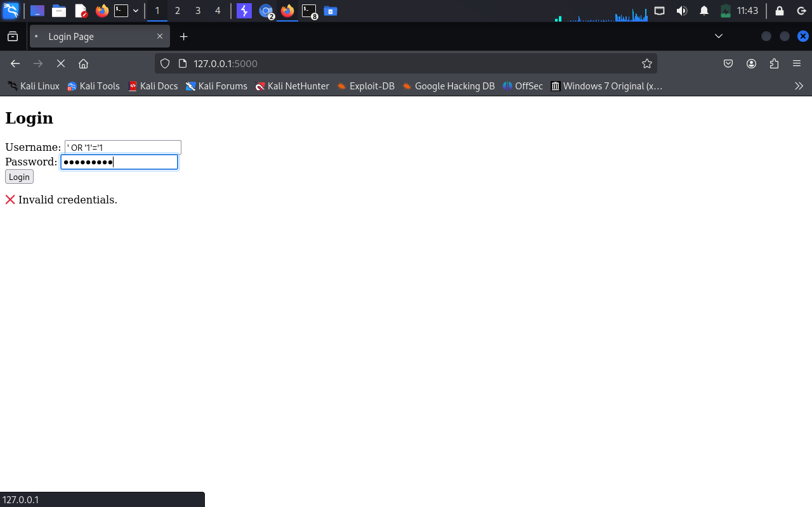

# SQL-Injection-Demo

A simple Flask web application that demonstrates **how SQL Injection works** and how to protect against it using **parameterized queries**. This educational tool helps security learners understand and test SQLi in a safe local environment.

---

## 📌 Problem Statement

SQL Injection is one of the most dangerous vulnerabilities in web applications. It occurs when an attacker is able to manipulate SQL queries by injecting malicious input. This can lead to data leakage, bypass authentication, or even full database control.

---

## 🎯 Objective

Build a Python-based web application to:
- Simulate a login form vulnerable to SQL injection
- Show how login bypass works (`' OR 1=1 --`)
- Switch to a secure mode using parameterized queries

---

## 🧰 Technologies Used

- **Python 3**
- **Flask** web framework
- **SQLite3** database
- HTML (via Jinja2 templating)

---

## ⚙️ Features

- Toggle between **vulnerable** and **secure** mode
- SQL injection login bypass in unsafe mode
- Secure login with proper input handling
- Clean CLI and browser-based demo

---

## 🛠️ Requirements

- Python 3.x
- Flask (`pip install flask`)
- SQLite3 (usually pre-installed)
- Browser (for local testing)

---

## 🚀 How to Run

### 📦 1. Clone or Download
```bash
git clone https://github.com/your-username/sql-injection-demo.git
cd sql-injection-demo
```
🗃️ 2. Create the Database
```
sqlite3 demo.db < schema.sql
```
▶️ 3. Run the Application
```
python3 app.py
```
🌐 4. Open in Browser
```
http://127.0.0.1:5000
```
### 💻 GUI in Action
 |  |  |   |
 |  |  |


 ✅ Built by **Kalpesh Dhamanse** —  [GitHub](https://github.com/Kalpeshdhamanse/SQL-Injection.git)
